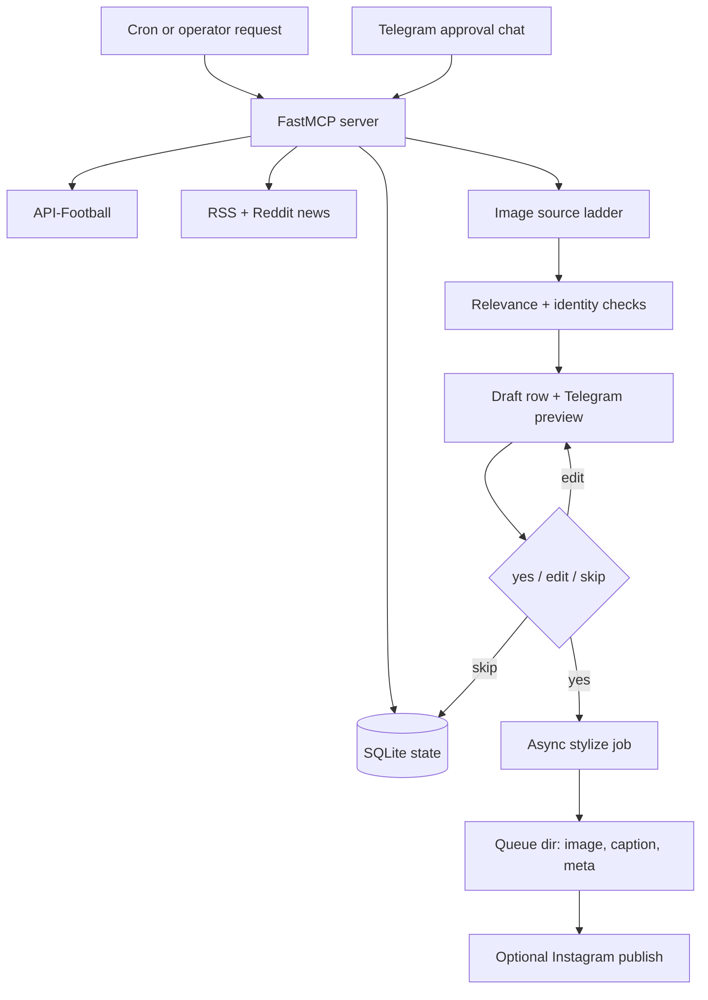

# Architecture

Mandem FC is a single-purpose social-media agent. The agent runtime owns the
brain, schedule, and Telegram conversation. This repo provides the MCP tool
server, SQLite schema, image pipeline, provider wrappers, and tests.

## Flow



## Core Components

- `scripts/mandem_mcp.py` exposes 35 tools for polling fixtures, ranking news,
  selecting images, saving drafts, sending approval DMs, stylizing images,
  recaptioning, publishing, and querying state.
- `scripts/mandem_db.py` owns the public SQLite schema: `ft_events`,
  `post_drafts`, `news_items`, `reddit_radar`, `telegram_state`, and
  `stylize_jobs`.
- `scripts/mandem/stylize_async.py` starts background image jobs with a bounded
  thread pool and persists status transitions.
- `scripts/mandem/stylize.py` performs the post-approval visual pipeline:
  overlay phrase, AI edit, identity check, 4:5 normalization, and composite
  fallback.
- `scripts/mandem/vision_check.py` checks whether selected or edited images
  still match the intended subject.
- `scripts/mandem/captions.py` resolves final captions and supports caption-only
  edits without regenerating approved images.

## State And Files

Writable state defaults to `~/.local/share/mandem-fc` and can be overridden with
`MANDEM_DATA_DIR`.

```text
<MANDEM_DATA_DIR>/
├── db.sqlite
├── images/
└── queue/
    └── <timestamp>/
        ├── image.jpg
        ├── caption.md
        └── meta.json
```

Configuration is loaded from the process environment, then from the optional
`MANDEM_ENV_FILE`, then from local `.env`.

## Design Choices

- MCP tools are narrow and stateful. The agent decides what to do, but tools
  persist enough context to recover from restarts and avoid duplicate posts.
- Approval is explicit. Drafts move through pending, approved, stylizing,
  queued, posted, skipped, or failed states.
- Image generation is never trusted blindly. Identity mutation or provider
  failure falls back to deterministic Pillow output from the approved source.
- Tests focus on the risky edges: image normalization, retries, fallbacks,
  smoke-key requirements, ranking, season modes, and caption rewrite behavior.
