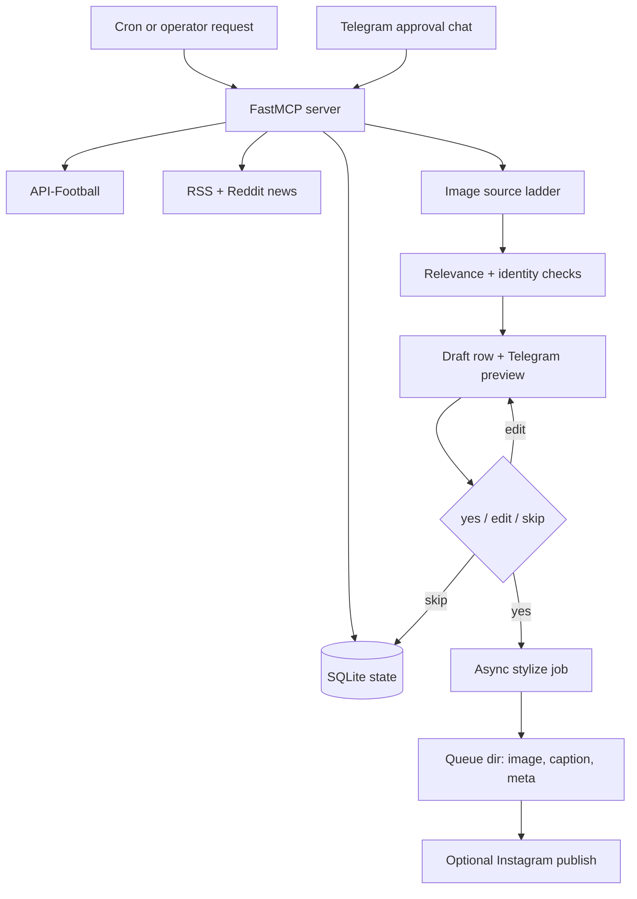

# Football Content Agent

A live, deployed AI agent that runs a football social-media brand end-to-end:
it watches fixtures and news, drafts opinionated posts with match graphics, and
publishes only after a human approves each draft over Telegram. 35 FastMCP
tools, SQLite state, async image jobs, identity checks, deterministic fallbacks,
and 67 passing tests.

It is the production case study for the
[ai-social-content-agent](https://github.com/mirasolutions06/ai-social-content-agent)
engine: the same approval-gated, human-in-the-loop core, specialized for football
(fixtures, lineups, player imagery, match-day timing). The engine repo is the
reusable version; this repo shows it running for real.

The work is not "generate a caption"; it is the operating system around that
caption: event polling, ranking, state, approval, async jobs, image safety
checks, deterministic fallbacks, and recovery.

## Demo

Screen recording coming soon: draft creation, Telegram approval, async
stylization, and the final queued post.

## Live Output

Example approved posts are published at
[@mandemfchq](https://www.instagram.com/mandemfchq/). The GitHub repo is
sanitized and does not include live deployment details, credentials, or private
operator state.

## Architecture



A human approves every draft before anything publishes. See
[ARCHITECTURE.md](ARCHITECTURE.md) for the full component breakdown.

## Model And Tool Stack

- Agent interface: FastMCP stdio server with 35 tools, 3 resources, and 2 prompts.
- Deployed agent brain: GPT-5.5. The MCP tool layer is model-swappable and
  can run behind any MCP-capable agent runtime.
- Image stylization: fal.ai ByteDance Seedream v4 edit with aura-sr upscaling.
- Overlay and vision checks: Gemini 2.5 Flash by default, configurable via env.
- Generated fallback images: OpenAI `gpt-image-2`, with provider keys split from
  the agent brain so image generation can keep working during model swaps.
- Core integrations: Telegram Bot API, API-Football, RSS feeds, Reddit JSON,
  Wikimedia Commons, Brave image search, Pexels, Cloudflare R2, Instagram Graph API.

## What It Proves

- Agent tool design with 35 FastMCP tools, 3 resources, and 2 prompts.
- SQLite-backed state for fixtures, drafts, news, Telegram messages, and jobs.
- Human-in-the-loop approval via Telegram before anything is published.
- Async stylization jobs so long image calls do not block MCP RPCs.
- Image-source ladder: official player photos, news search, Wikimedia, Pexels,
  generated images, and deterministic Pillow composites.
- Identity and relevance checks before using AI-edited player imagery.
- Practical fallback behavior when APIs fail, images mutate, or live data is missing.
- Reproducible public test suite: `make test`.

## Quick Start

```bash
python3 -m venv .venv
. .venv/bin/activate
make install
make test
cp .env.example .env
make db-init
```

To run the MCP server locally:

```bash
MANDEM_DATA_DIR="$PWD/.mandem-data" python3 scripts/mandem_mcp.py
```

Real provider calls require environment variables in `.env` or a server env file
referenced by `MANDEM_ENV_FILE`. Tests do not require live secrets.

## Repository Layout

```text
.
├── scripts/
│   ├── mandem_mcp.py        # FastMCP stdio server
│   ├── mandem_db.py         # SQLite schema/query/cleanup helper
│   ├── smoke.py             # Environment and feed smoke checks
│   ├── mandem/              # Agent modules
│   └── tests/               # 67 tests
├── ARCHITECTURE.md
├── RUNBOOK.md
├── FAILURE_MODES.md
├── Makefile
├── requirements.txt
└── .github/workflows/ci.yml
```

## Docs

- [ARCHITECTURE.md](ARCHITECTURE.md) explains the pipeline and system boundaries.
- [RUNBOOK.md](RUNBOOK.md) covers local setup, server wiring, and useful commands.
- [FAILURE_MODES.md](FAILURE_MODES.md) lists known failure modes and mitigations.

## Public-Safe Notes

This repo is a sanitized proof repo. It intentionally excludes private workspace
memory, historical handoff docs, live hostnames, IPs, chat IDs, secrets, and
deployment-specific paths. Keep real credentials in `.env` locally or in a server
environment file outside git.

## Contact

Built and operated by Mira Solutions, an AI engineering and automation studio.

mira.solutions06@gmail.com
